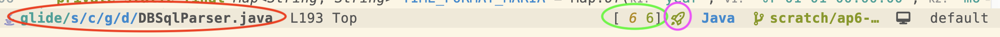
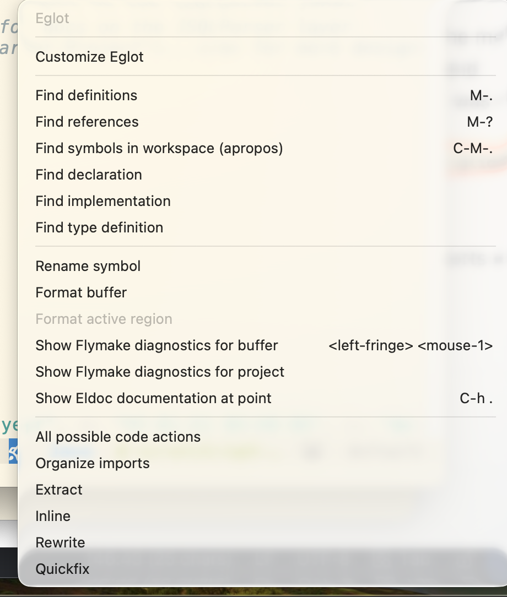
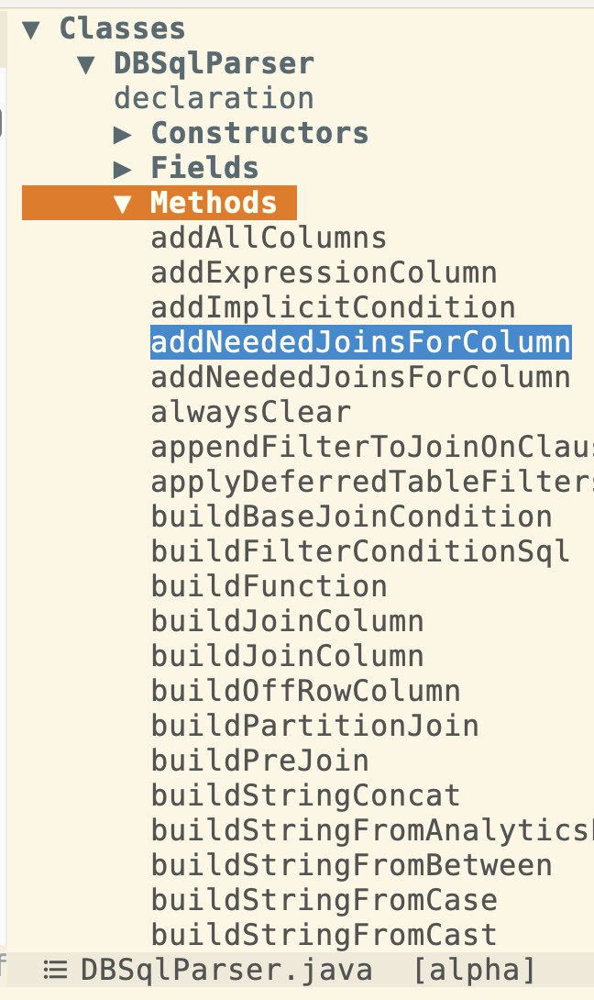

q# Introduction

When I first started using LSP, jdtls (the java language server) and emacs, I installed lsp-mode because it was recommended online in the various places I first looked (youtube, reddit etc.). After the normal configuration issues were ironed out  that worked fine for my initial test scenarios. But recently, I've decided that lsp-mode makes some design choices that around integration with UI, treemacs and file layouts etc. that I'm not sure I like and it would be fun to experiment with the built-in eglot and see how it compares. A recent regression in the  diagnostics build warnings/errors side window's ability to move to the line via a right click  for each issue while fixable was the final motivation for me to give eglot a try. This was also an opportunity to reexamine some configuration I have never fully cleaned up in the first place.

# Initial Chaos
To begin with after making sure I was at a clean state with my config files in git, I deleted all the lsp-mode related lines in my init.el and then went to a sample java file and invoked eglot. Since its built-in I didn't need to even add a `use-package` declaration.  And then predictably **chaos** ensued.  More accurately at first nothing happened.  After examining the messages buffer I realized my issue.   First, I thought the jdtls artifacts i had previously used with lsp-mode would just work when I transitioned but they were not found initially by eglot. Also by this time I had long since forgotten where lsp-mode placed them.  I prefer my binaries to be by convention  in the same general location, so rather than relying on an emacs package to install jdtls to some one off directory under emacs.d, I directly installed it via homebrew. That's a more sustainable management pattern for me for the long term. I can use `which` to find it, `homebrew upgrade` to keep it up to date like all other programs  and it just runs off the command line if I invoke  `jdtls. As a side benefit, no path configuration is needed within emacs to start it.

With that in place, I started over, invoked eglot and my emacs just silently froze for about a minute before sputtering out an error message	about timing out and  shutting down the server.   I have to deal with fairly large git repos at work and it takes time to load and process them.  So the next step was bumping up the initial connection timeout along with limiting the number of files to watch to reasonable cap.

```
(setq eglot-connect-timeout 180)
(setq eglot-max-file-watches 5000)
```

What also became apparent from the bit of output I found in the logs (see below) was more files were being processed than I expected. This is due to the file structure at work which heavily uses gradle subprojects.   But by default `project.el` sets the root of a project to the repo's git root and that's also the root of the workspace that eglot uses for compilation.  In other words, I was pulling in the universe each time I opened a file.  The fix here was to tell project that the boundary was at the first build.gradle file it found as well as the git root  so only the  subproject I was using was processed by jdtls. I was curious if this was going to work since the subprojects do refer to common  gradle files up in the parent but thankfully there were no gotchas this time.

```
;; Set project boundary at the first build.gradle found as well
(setopt project-vc-extra-root-markers '("build.gradle"))
```


# Formatting JSON-RPC

Eglot was connecting fine if I waited long enough now. But it still was a disconcerting experience with almost no UI feedback as to what was going on. Side note: I found it hard to find documentation giving you a picture of the expected experience to compare which is part of my motivation for this writeup.  What I found that was extremely useful  during my experimentation is the *EGLOT ...* diagnostic buffer which contains a raw dump of the messages between emacs and the LSP server. However, there are a lot of messages going back and its not that easy to parse at a glance. It turns out there are 3 formats for this buffer which can be configured via `eglot-events-buffer-config `:

1. full - dumps the json as is and is the default
2. lisp - formats the json as a lisp structure
3. short - gives a short one line summary

In theory the short format sounded helpful but it unfortunately hides the message fields that contain most of the useful information.  So I instead wrote a custom filter to focus on presenting a timestamp and the description field and to filter out a few of the begin/end message pairs that aren't normally useful.

```
[jsonrpc] e[23:22:53.541] <-- initialize[1]
[jsonrpc] e[23:22:53.541] --> initialized #s(hash-table)
[jsonrpc] e[23:22:53.569] <-- window/workDoneProgress/create[1] (:token <elided>)
[jsonrpc] e[23:22:53.573] <-- window/workDoneProgress/create[2] (:token <elided>)
[jsonrpc] e[23:22:53.573] <-- $/progress report: Building - 0%
[jsonrpc] e[23:22:53.594] <-- language/status (:type Starting :message Init...)
[jsonrpc] e[23:22:53.594] <-- language/status (:type Starting :message 0% Starting Java Language Server)
[jsonrpc] e[23:22:53.594] <-- window/workDoneProgress/create[3] (:token <elided>)
[jsonrpc] e[23:22:53.595] <-- $/progress report: Initialize Workspace - 0%
[jsonrpc] e[23:22:53.595] <-- window/workDoneProgress/create[4] (:token <elided>)
[jsonrpc] e[23:22:54.271] <-- language/status (:type Starting :message 70% Starting Java Language Server)
[jsonrpc] e[23:22:54.271] <-- $/progress report: Importing Gradle project(s) - 70%
[jsonrpc] e[23:22:55.770] <-- language/eventNotification (:eventType 200 :data [file:/Users/benjamin.leis/dev/jdk17/glide/glide/ file:/Users/benjamin.leis/dev/jdk17/glide/glide/ui.html/styles/polaris/])
[jsonrpc] e[23:23:03.790] <-- language/status (:type Starting :message 70% Starting Java Language Server - Configure build)
[jsonrpc] e[23:23:03.790] <-- $/progress report: Importing root project - 70% Configure build
[jsonrpc] e[23:23:04.289] <-- language/status (:type Starting :message 70% Starting Java Language Server - Configure project :buildSrcCommon:buildSrc)cccccbvnnbrdecrgirrjlnfdtvfjdvchldrbdenrfjjh

[jsonrpc] e[23:23:04.289] <-- $/progress report: Importing root project - 70% Configure project :buildSrcCommon:buildSrc
```

This is a bit heavyweight and I'm deciding if I will continue to use it but for the initial debugging of the process it sped things up quite a bit. So now I could park on this buffer during startup and watch the process during the UI freezes and also see some indication of when import had finished.  I also discovered by this point, it's only  an issue during initial import and reconnects are asynchronous.   This seems to be an artifact of the LSP protocol, fundamental eglot design and emacs relatively weak support for threading and I don't think I can tune it further  (but  I'm curious if anyone has found something for a truly asynchronous connect process that I don't know about)

Also watching the messages, it was clear some were progress reports that should be displayed somewhere and I didn't have the configured properly.  Looking around I found eglot does try to add a summary to the mode line but many of these messages are a full line length and don't fit. I actually had some sporadic `[Eglot: module]` messages showing up there I had ignored because they never changed. To make this more useful I switched the updates to use the message buffer

```
(setq eglot-report-progress 'messages) ;; progress updates in the message bar
```

This was a huge improvement. I could see the *full*  latest progress updates in the buffer even if the UI was otherwise frozen and getting the progress updates was enough feedback for me to make the import process tolerable.  It also gave me a much stronger indication of when jdtls was really up and running and I could rely on the flymake output.


# Fixing the mode-line

Now I went back to the mode-line again. The above experience had clued me into the fact that my own customizations of the mode line might be interfering with the default experience. I use `doom-modeline` and a lot of config code around it.  So I turned it off and confirmed - that there was some extremely useful segments for both the flymake compile information and eglot itself that I was missing.


* Eglot depends on flymake for the buffer compile diagnostics
* It has a main segment where it chains top line eglot actions including things like connecting to a server, organizing imports etc.

So I went back to my mode line customizations for doom-modeline and added its built in segments for both missing pieces.  I chose a very small width set of texts because screen space is fairly cramped on the modeline when working with LSP already. I have a single one character icon for eglot's main context menu and a minimal count for flymake.


* The red section is the current file with the project root highlighted in a slightly different shade of blue so I can confirm its correct.
* The green section is the flymake info/error/warning block and clicking on it will open the dedicated `flymake-show-buffer-diagnostics` windows
* the purple icon is the eglot main "button". When clicked on the following context menu pops up.



A lesson out of all of this is I should probably spend some time - going back to the built in mode line at some point.

# Tuning jdtls
Next up, I did a few tune ups of the jdtls configuration. The most important one was defining a data directory for it to dump data in rather than polluting my git repo with tons of files. I decided to setup a jdtls-cache under my .emacs.d directory   But I also turned off some lsp functions like the semantic tokens and current light highlighting which are handled locally by treesitter.  I may further tune the jvm memory settings as well here in the future to see if it speeds anything up.

```
;; set java home
(setq java-home "/Users/benjamin.leis/.jenv/versions/21.0")
(setenv "JAVA_HOME" java-home)

;; Pin the java version for JDT. Set it here and after the load.
(setq my-jdtls-settings
      `(:java (
	       :home ,java-home)))

(setq eglot-ignored-server-capabilities '(:semanticTokensProvider :documentHighlightProvider))

(with-eval-after-load 'eglot
  ;; Keep jdtls metadata in a per-project dir under jdtls-cache.
  ;; Must be a function, not a precomputed path: eglot only loads
  ;; (and evaluates this let-binding) once, on first use, so a
  ;; a lambda is needed.
  (add-to-list 'eglot-server-programs
               `((java-mode java-ts-mode)
                 . ,(lambda (&optional _interactive project)
                      (let ((cache-dir (expand-file-name
                                        (md5 (or (and project (project-root project))
                                                 default-directory))
                                        (locate-user-emacs-file "jdtls-cache"))))
                        (list "jdtls"
                              "--jvm-arg=-Djava.import.generatesMetadataFilesAtProjectRoot=false"
                              "-data" cache-dir
                              :initializationOptions
                              (list :settings my-jdtls-settings)))))))

```


Jdtls unfortunately has a few files like `bin/main` and `bin/test` that it still creates in place and which are not configurable. So for them I added some git ignore rules so they don't mess up my local git status.

# Cleaning my imenu-list indexer for java
I depend on `imenu-list` for navigation in almost all buffers but it unfortunately has a relatively minimal integration with java-ts-mode currently. So I had written a custom index function in the past for lsp-mode to beef that up and add hierarchical listing by class and configurable sorting of functions.  I brought that over while fixing a small bug I found in my internal index structures and then decided to add a hotkey to change the sort this time.   This takes advantage of some general customization I do with it to use arrow icons, faces and auto collapse to a  given depth on first usage.



# Adding Treesit-fold
Finally, I've gotten used to having my java imports folded in tools like intellij. So I'm trying out `treesit-fold` this time around. It unfortunately doesn't recognize import statements by default because they aren't a block in the treesitter AST but that's easy to fix via configuration.

```
;; Java's grammar has no single node wrapping all the imports -- each
;; import_declaration is just a sibling of the next, so folding on
;; import_declaration alone (e.g. via treesit-fold-range-seq) only ever
;; folds one import. This walks forward across the run of consecutive
;; import_declaration (and interleaved comment) siblings so that folding
;; on any import line collapses that line and every import after it.
(defun treesit-fold-range-java-imports (node offset)
  "Fold the contiguous run of Java import declarations starting at NODE."
  (let ((last-node node)
        (sibling (treesit-node-next-sibling node t)))
    (while (member (treesit-node-type sibling)
                    '("import_declaration" "line_comment" "block_comment"))
      (when (equal (treesit-node-type sibling) "import_declaration")
        (setq last-node sibling))
      (setq sibling (treesit-node-next-sibling sibling t)))
    (unless (treesit-node-eq last-node node)
      (treesit-fold--cons-add
       (cons (treesit-node-start node) (treesit-node-end last-node))
       offset))))

(use-package treesit-fold
  :ensure t
  :vc (:url "https://github.com/emacs-tree-sitter/treesit-fold")
  :config
  ;; Add a rule for java-mode and java-ts-mode to fold the whole run of imports at once
  (dolist (mode '(java-mode java-ts-mode))
    (push '(import_declaration . treesit-fold-range-java-imports)
          (alist-get mode treesit-fold-range-alist)))
  (dolist (mode '(java-mode java-ts-mode))
    (setf (alist-get mode treesit-fold-summary-parsers-alist)
          #'treesit-fold-summary-java))
  (add-hook 'context-menu-functions #'context-menu-fold-line))

```

I also went crazy and added a custom summary function based on the treesitter node AST type so its labeled import-declarations rather than just "..." and then put a context menu action on the number line I have on the right to offer folding as an option.  Finally I setup auto folding to occur when java mode starts up.


```
;; Automatically fold the import block when a Java buffer is opened, called
;; from `setup-common-java' below.
(defun treesit-fold-close-java-imports ()
  "Fold the run of Java import declarations at the top of the buffer, if any."
  (when (and (treesit-available-p) (treesit-parser-list) (treesit-fold-usable-mode-p))
    (when-let* ((first-import
                 (seq-find (lambda (n) (equal (treesit-node-type n) "import_declaration"))
                           (treesit-node-children (treesit-buffer-root-node)))))
      ;; `treesit-fold-summary-java' recovers the folded node from `point',
      ;; so move there rather than passing the node to `treesit-fold-close'
      ;; directly -- see the comment above `treesit-fold-summary-java'.
      (goto-char (treesit-node-start first-import))
      (treesit-fold-close))))


(defun setup-common-java ()
  (setq c-basic-offset 4
        tab-width 4
        indent-tabs-mode t)
  (setq-local imenu-depth 3)
  (setq-local imenu-create-index-function 'my/generate-ts-imenu)
  (treesit-fold-mode)
  (treesit-fold-close-java-imports))

(add-hook 'java-mode-hook 'setup-common-java)
(add-hook 'java-ts-mode-hook 'setup-common-java)
```

Also worth noting, is at one point with lsp-mode I had setup the java mode hooks to automatically start it. I took that out very quickly due to the expensive startup times with jdtls.  For eglot I continued that practice. I have to manually `C-x eglot` to start it up when I want to use it.

# Faces
Finally with eglot faces turned off via the :semanticTokensProvider switch I went back to the treesitter formatting configuration. I have an already fairly minimalist set of colors that I use. For most code elements I prefer to just use my default text color. I really only want to see a few things like local variables, strings and function names strongly signaled in a different format.

# Summary
All the above configuration, took me a few days on and off.  At the end, I have a basic environment that is usable.  However, sadly I'm still going to continue using my main editor Intellij for my day to day work. That is due to a few things.

1. jdtls is fairly flaky. About half the time I start it up and it doesn't correctly import the workspace and fails to recognize all the imports. Doing an eglot-reconnect fixes the issue but this is symptomatic of the general state its in.  There are more incompatibilities with java annotation processing etc.   I also really want to be able to completely tune it to leave all files outside the git repo.

2. Intellij has richer code actions, warnings and advice and tooling for debuggers, profilers etc. Trying to do deep work is still easier there as frustrating as Intellij can also be at times.

2. eglot's synchronous startup. This is tolerable but long term I'd like the UI freezes to be fully ironed out.


That said, I actually really like eglot when its running and I may use it more often for ancillary tasks. Given time, I'm hoping the above issues are mitigated as well.
