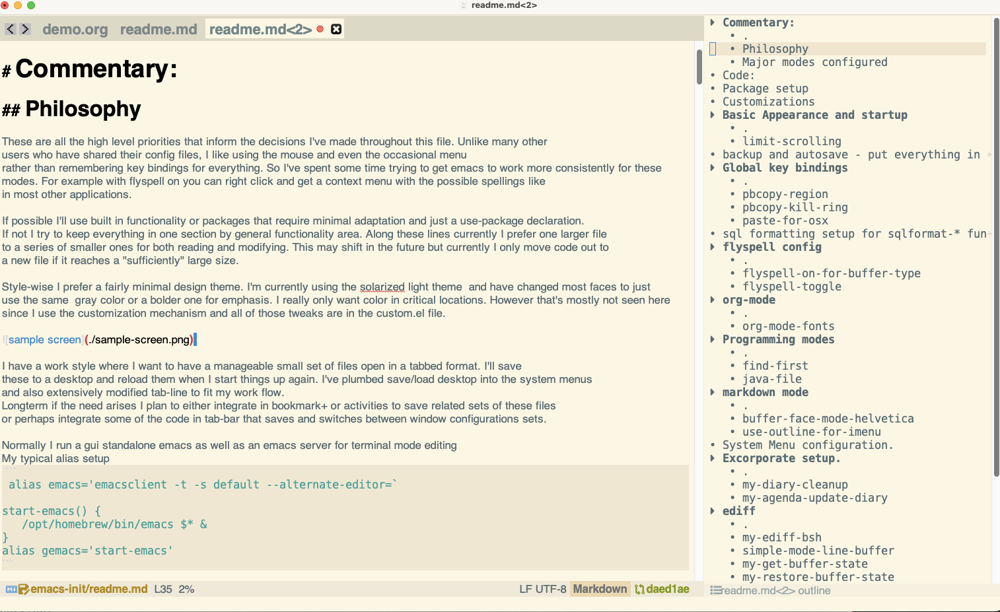

```
 oooooooooooo
 `888'     `8
  888         ooo. .oo.  .oo.    .oooo.    .ooooo.   .oooo.o
  888oooo8    `888P"Y88bP"Y88b  `P  )88b  d88' `"Y8 d88(  "8
  888    "     888   888   888   .oP"888  888       `"Y88b.
  888       o  888   888   888  d8(  888  888   .o8 o.  )88b
 o888ooooood8 o888o o888o o888o `Y888""8o `Y8bod8P' 8""888P'
```

My emacs configuration file

Author: Benjamin Leis

# Commentary:

## Philosophy

These are all the high level priorities that inform the decisions I've made throughout this file. Unlike many other
users who have shared their config files, I like using the mouse and even the occasional menu
rather than remembering key bindings for everything. So I've spent some time trying to get emacs to work more consistently for these
modes. For example with flyspell on you can right click and get a context menu with the possible spellings like
in most other applications.

If possible I'll use built in functionality or packages that require minimal adaptation and just a use-package declaration.
If not I try to keep everything in one section by general functionality area. Along these lines currently I prefer one larger file
to a series of smaller ones for both reading and modifying. This may shift in the future but currently I only move code out to
a new file if it reaches a "sufficiently" large size.

I have a work style where I want to have a manageable small set of files open in a tabbed format. I'll save
these to a desktop and reload them when I start things up again. I've plumbed save/load desktop into the system menus
and also extensively modified tab-line to fit my work flow.
Longterm if the need arises I plan to either integrate in bookmark+ or activities to save related sets of these files. For now I have customized tab-line with "views" to facilitate this. See tab-config.el for more details.

Style-wise, I prefer a fairly minimal design theme. I'm currently using the solarized light theme  and have changed most faces to just
use the same  gray color or a bolder one for emphasis. I really only want color in critical locations. However that's mostly not seen here
since I use the customization mechanism and all of those tweaks are in the custom.el file.

Sample screen:


Normally I run a gui standalone emacs as well as an emacs server for terminal mode editing
My typical alias setup
 ```
 alias emacs='emacsclient -t -s default --alternate-editor=`

start-emacs() {
   /opt/homebrew/bin/emacs $* &
}
alias gemacs='start-emacs'
```

## Major modes configured
- Markdown
- Org
- Java
- Ediff
- Python (partly)

# Code:
<!-- markdown-toc start - Don't edit this section. Run M-x markdown-toc-refresh-toc -->
**Table of Contents**

- [Commentary:](#commentary)
    - [Philosophy](#philosophy)
    - [Major modes configured](#major-modes-configured)
- [Code:](#code)
- [Package setup](#package-setup)
- [Customizations](#customizations)
- [Basic Appearance and startup](#basic-appearance-and-startup)
    - [limit-scrolling](#limit-scrolling)
    - [my-before-save-hook](#my-before-save-hook)
- [backup and autosave - put everything in ~/.saves](#backup-and-autosave---put-everything-in-saves)
- [Dired](#dired)
- [Global key bindings](#global-key-bindings)
    - [pbcopy-region](#pbcopy-region)
    - [pbcopy-kill-ring](#pbcopy-kill-ring)
    - [paste-for-osx](#paste-for-osx)
- [sql formatting setup for sqlformat-* functions.](#sql-formatting-setup-for-sqlformat--functions)
- [flyspell config](#flyspell-config)
    - [flyspell-on-for-buffer-type](#flyspell-on-for-buffer-type)
    - [flyspell-toggle](#flyspell-toggle)
- [org-mode](#org-mode)
    - [org-mode-fonts](#org-mode-fonts)
- [Programming modes](#programming-modes)
- [Java](#java)
    - [my/make-marker](#mymake-marker)
    - [my/get-def-name](#myget-def-name)
    - [my/get-field-name](#myget-field-name)
    - [my/imenu-leaf](#myimenu-leaf)
    - [my/imenu-compare](#myimenu-compare)
    - [my/imenu-sort](#myimenu-sort)
    - [my/walk-object-declaration](#mywalk-object-declaration)
    - [my/generate-ts-imenu](#mygenerate-ts-imenu)
    - [modify-java-ts-syntax-highlighting](#modify-java-ts-syntax-highlighting)
    - [java-hook](#java-hook)
- [Common LSP + python](#common-lsp--python)
    - [my-treemacs-sort-by-kind-alphabetically](#my-treemacs-sort-by-kind-alphabetically)
    - [lsp-treemacs-symbols-switch-sort](#lsp-treemacs-symbols-switch-sort)
- [markdown mode](#markdown-mode)
    - [buffer-face-mode-helvetica](#buffer-face-mode-helvetica)
    - [use-outline-for-imenu](#use-outline-for-imenu)
    - [my/imenu-list-sort-alphabetically](#myimenu-list-sort-alphabetically)
    - [my/imenu-current-sort](#myimenu-current-sort)
    - [my/imenu-list-sort-advice](#myimenu-list-sort-advice)
    - [imenu-list-switch-sort](#imenu-list-switch-sort)
- [System Menu configuration.](#system-menu-configuration)
- [Excorporate setup.](#excorporate-setup)
    - [my-diary-cleanup](#my-diary-cleanup)
    - [my-agenda-update-diary](#my-agenda-update-diary)
- [ediff](#ediff)
    - [my-ediff-bsh](#my-ediff-bsh)
    - [simple-mode-line-buffer](#simple-mode-line-buffer)
    - [my-get-buffer-state](#my-get-buffer-state)
    - [my-restore-buffer-state](#my-restore-buffer-state)
    - [my-ediff-prep-buffers](#my-ediff-prep-buffers)
    - [my-ediff-qh](#my-ediff-qh)
    - [command-line-diff](#command-line-diff)
    - [ediff-add-buttons](#ediff-add-buttons)
    - [gc-notification](#gc-notification)
- [Completion frameworks.](#completion-frameworks)
    - [font-family-widget-p](#font-family-widget-p)
    - [complete-font-name](#complete-font-name)
    - [add-complete-font-name](#add-complete-font-name)

<!-- markdown-toc end -->

# Package setup

Define an ignore macro that doesn't even evaluate the argument. This is useful for
display purposes when using elispdoc rather than commenting whole regions out.
```
(defmacro my-ignore (form))
```

Setup melpa as a repository.
```
(require 'package)
(add-to-list 'package-archives '("melpa" . "https://melpa.org/packages/") t)
```
Comment/uncomment this line to enable MELPA Stable if desired.  See `package-archive-priorities`
and `package-pinned-packages`. Most users will not need or want to do this.
```
(my-ignore (add-to-list 'package-archives '("melpa-stable" . "https://stable.melpa.org/packages/") t))
(package-initialize)
```

use-package to simplify package loading.
```
(unless (package-installed-p `use-package)
  (package-refresh-contents)
  (package-install `use-package))

(eval-when-compile
  (require 'use-package))
```

early on setup follow-symlinks to true for loaded files
```
(setq vc-follow-symlinks t)
```

# Customizations

See https://www.gnu.org/software/emacs/manual/html_node/emacs/Easy-Customization.html
All customizations are stored on the side in custom.el
```
(setq custom-file (concat user-emacs-directory "custom.el"))
(when (file-exists-p custom-file)
  (load custom-file))
```

# Basic Appearance and startup
A set of configurations related to display style that are not covered by customized faces and variables

Make things silently start.
```
(setq inhibit-splash-screen t
      inhibit-startup-screen t
      initial-buffer-choice nil
      initial-scratch-message "")
```

Initial major mode is text for new buffers
```
(setq-default major-mode 'text-mode)
```

Use winner mode by default for managing window configurations
particularly useful when popping up a 2nd or 3rd window and
wanting to go back to the previous config.
```
(winner-mode 1)
```

turn off menu mode in text mode to save space
```
(unless window-system
  (menu-bar-mode 0))
```

turn on demand scroll bars when in window mode
Use the normal right click brings up a context menu
```
(when window-system
  (use-package on-demand-scroll-bar
    :load-path "/Users/benjamin.leis/.emacs.d/on-demand-scroll-bar"
    :config
    (on-demand-scroll-bar-mode 1))
  (context-menu-mode)
  ;;(scroll-bar-mode))
)

(my-ignore (setq scroll-conservatively 10))
```

## limit-scrolling
WIP: Scroll only to the last line
this is still a bit buggy and not quite the right behavior.
```
(defun limit-scrolling (&optional win start)
  ;; handle case where buffer is totally empty
  (unless (= (buffer-size) 0)
    (progn
      (my-ignore (message "start %s window-start %s bufsize %s point %s"
	       start (window-start) (buffer-size) (point)))
      (let ((visible-lines (count-lines (or start (window-start)) (buffer-size)))
            (lines-to-end (count-lines (point) (buffer-size))))
	(when (< visible-lines (window-text-height))
	  (progn
	    (recenter (- lines-to-end))))))))
```

Only install the limit scrolling hook on gui modes where scrolling is enabled
```
(when window-system
  (add-hook 'post-command-hook #'limit-scrolling))
```

## my-before-save-hook

Generally remove trailing white space except on markdown

```
(defun my-before-save-hook ()
  (unless (equal major-mode 'markdown-mode)
      (delete-trailing-whitespace)))

(add-hook 'before-save-hook #'my-before-save-hook)
```

Auto complete on tab if not at start of line in modes
where tab auto indents
```
(setq tab-always-indent 'complete)
(add-to-list 'completion-styles 'initials t)
```

Switch buffer name context tip to actually be the buffer-name.
```
(setq-default mode-line-buffer-identification
              (list (propertize
                     "%12b"
                     'face 'mode-line-buffer-id
                     'help-echo
                     '(format "%s\nmouse-1: Previou2 buffer\nmouse-3: Next buffer"
                       (buffer-name))
                     'mouse-face 'mode-line-highlight
                     'local-map mode-line-buffer-identification-keymap)))
```

Override the default value so isearch is always full screen. If set too low emacs tries to render less
```
(setq baud-rate 19200)
```

Use short y or no prompts.
```
(setopt use-short-answers t)
```

Revert Dired and other buffers
```
(customize-set-variable 'global-auto-revert-non-file-buffers t)
```

Revert buffers when the underlying file has changed
```
(global-auto-revert-mode 1)
```

Enable mouse in text mode
Note: this removes iterm2 cut and paste integration so we add advice later on to call pbcopy after copying to the kill ring
```
(unless window-system
  (require 'mouse)
  (xterm-mouse-mode t)
  (defun track-mouse (e))
  (setq mouse-sel-mode t))
```

Setup recent files mode
```
(recentf-mode 1)
(setq recentf-max-menu-items 25)
(setq recentf-max-saved-items 25)
```

Try out undo-tree - if its useful enable persistent storage of the tree
```
(use-package undo-tree
  :ensure t)
```

# backup and autosave - put everything in ~/.saves

```
(setq
 auto-save-default nil ;; disable auto save files
 auto-save-file-name-transforms `((".*" , "~/.save" t))
 backup-by-copying t      ; don't clobber symlinks
 backup-directory-alist
 '(("." . "~/.saves/"))    ; don't litter my fs tree
 delete-old-versions t
 kept-new-versions 6
 kept-old-versions 2
 version-control t)
```

# Dired

Icons for dired. I'm not sure if I care enough to keep this longterm yet.
```
(use-package all-the-icons-dired
  :if window-system
  :ensure t
  :hook ((dired-mode . all-the-icons-dired-mode))
  )
```

Do all dired ops in a single window
```
(setq dired-kill-when-opening-new-dired-buffer t)
```
allow find-alternate-file i.e. open and kill dired
```
(put 'dired-find-alternate-file 'disabled nil)
```

doom-modeline setup
Note: its important to have a nerd font installed for the icons to work properly
I usd DejaVu Sans Mono with the Nerd Font extension
For now I leave the icons on even in terminal mode although they are a bit too small there.
```
(use-package doom-modeline
  :ensure t
  :init (doom-modeline-mode 1))
```

Load all of my custom tab-line config.
```
(load "~/.emacs.d/tab-config.el")
```

# Global key bindings
I try to keep this minimally different from stock emacs.
my preference is for short key strokes and to usually bind global things to
function keys.

```
(global-set-key (kbd "C-u") 'undo)
(global-set-key (kbd "<f1>") 'treemacs)
(global-set-key (kbd "<f2>") 'org-capture)
(global-set-key (kbd "C-\\") 'imenu-list-smart-toggle)
(global-set-key (kbd "C-<tab>") 'tab-line-switch-to-next-tab)
(global-set-key (kbd "C-S-<tab>") 'tab-line-switch-to-prev-tab)
```

I hit cmd-x too often expecting M-x which is dangerous so just bind it to that
TODO should I just bind cmd - to the meta key and give up up cmd-c and cmd-v?
```
(global-set-key (kbd "s-x") 'execute-extended-command)
```

Add standard minimal CUA  key bindings ctrl-c, ctrl-v insert paste etc.
TODO - I need ctrl-z to still be suspend in terminal mode so disabling for now.
```
(my-ignore (cua-mode))
```

## pbcopy-region
Copy to clipboard functions for terminal mode
copy the current region directly
```
(defun pbcopy-region ()
  (interactive)
  (call-process-region (point) (mark) "pbcopy")
  (setq deactivate-mark t))
```

## pbcopy-kill-ring
copy the latest kill ring
```
(defun pbcopy-kill-ring (&optional push)
  (interactive)
  (let ((process-connection-type nil)
	(text (current-kill 0)))
    (let ((proc (start-process "pbcopy" "*Messages*" "pbcopy")))
      (process-send-string proc text)
      (process-send-eof proc))))
```

## paste-for-osx
Final version hook into interprogram-cut-function instead
for terminal mode cut to system clipboard
```
(defun paste-for-osx (text &optional push)
  (let ((process-connection-type nil))
    (let ((proc (start-process "pbcopy" "*Messages*" "pbcopy")))
      (process-send-string proc text)
      (process-send-eof proc))))

(unless window-system
  (setq interprogram-cut-function 'paste-for-osx))
```

# sql formatting setup for sqlformat-* functions.
```
(setq sqlformat-command 'pgformatter)
(setq sqlformat-args '("-s2" "-g"))
```

# flyspell config

## flyspell-on-for-buffer-type
>Enable Flyspell appropriately for the major mode of the current buffer.  Uses `flyspell-prog-mode' for modes derived from `prog-mode', so only strings and comments get checked.  All other buffers get `flyspell-mode' to check all text.  If flyspell is already enabled, does nothing.

currently not bound to a key. I use the context menu instead.
```
(defun flyspell-on-for-buffer-type ()
      "Enable Flyspell appropriately for the major mode of the current buffer.  Uses `flyspell-prog-mode' for modes derived from `prog-mode', so only strings and comments get checked.  All other buffers get `flyspell-mode' to check all text.  If flyspell is already enabled, does nothing."
      (interactive)
      (if (not (symbol-value flyspell-mode)) ; if not already on
	(progn
	  (if (derived-mode-p 'prog-mode)
	    (progn
	      (message "Flyspell on (code)")
	      (flyspell-prog-mode))
	    ;; else
	    (progn
	      (message "Flyspell on (text)")
	      (flyspell-mode 1)))
	  )))
```

## flyspell-toggle
>Turn Flyspell on if it is off, or off if it is on.  When turning on, it uses `flyspell-on-for-buffer-type' so code-vs-text is handled appropriately.

```
(defun flyspell-toggle ()
  "Turn Flyspell on if it is off, or off if it is on.  When turning on, it uses `flyspell-on-for-buffer-type' so code-vs-text is handled appropriately."
  (interactive)
  (if (symbol-value flyspell-mode)
      (progn ; flyspell is on, turn it off
	(message "Flyspell off")
	(flyspell-mode -1))
    ; else - flyspell is off, turn it on
    (flyspell-on-for-buffer-type)))
```


preset modes to have flyspell on
```
(add-hook 'text-mode-hook 'flyspell-mode)
(add-hook 'prog-mode-hook 'flyspell-prog-mode)
```

Enable which key
```
(setq-default which-key-mode t)
(which-key-mode)
```

# org-mode
My typical usage of Org includes a main work tracking file, org-agenda, integration with my exchange calendar
and simple daily journal for which I have a capture template to add standup entries

mouse support
```
(require 'org-mouse)
```

hide emphasis markers
```
(setq org-hide-emphasis-markers t)
```

word wrap for normal text and stripe mode for tables
```
(with-eval-after-load 'org
  (add-hook 'org-mode-hook #'visual-line-mode)
  (add-hook 'org-mode-hoom #'stripe-buffer-mode))
```

TODO: come back to the font setup after looking at things
That Tex Gyre font isn't installed for instance

set fixed-width font
(set-face-font 'default "Source Code Pro-12")

set variable-width font
(set-face-font 'variable-pitch "TeX Gyre Pagella-13")

## org-mode-fonts
>Sets up display fonts for org-mode

Use monospaced font faces in current buffer
```
(defun org-mode-fonts ()
  "Sets up display fonts for org-mode"
  (interactive)
  (setq buffer-face-mode-face '(:family "TeX Gyre Pagella-13" :height 100))
  (buffer-face-mode))
```

Set default font faces for Info and ERC modes
```
(my-ignore (add-hook 'org-mode-hook 'org-mode-fonts))
```

set org-mode to use variable width fonts smartly
```
(use-package mixed-pitch
  :ensure t
  :hook (org-mode . mixed-pitch-mode))
```

hide asterisks in headers
ignored because right now I'm using base org-bullets-mode instead
```
(my-ignore
 (use-package org-bullets
   :ensure t
   :config
   (add-hook 'org-mode-hook (lambda () (org-bullets-mode 1)))
   (setq org-bullets-bullet-list '("\u200b"))
   ))
```

change list markers from hyphens ;to squares
ignored currently
```
(my-ignore (font-lock-add-keywords 'org-mode
                        '(("^ *\\([-]\\) "
                          (0 (prog1 () (compose-region (match-beginning 1) (match-end 1) "▪")))))))
```

increase line spacing
ignored currently because it looks bad with tables.
```
(my-ignore (add-hook 'org-mode-hook (lambda() (setq line-spacing 0.5))))
```

set the org-agenda prefix to skip printing the source files
```
(setq org-agenda-prefix-format '(
  ;; (agenda  . " %i %-12:c%?-12t% s") ;; file name + org-agenda-entry-type
  (agenda  . " %-12t ")
  (timeline  . "  % s")
  (todo  . " %i %-12:c")
  (tags  . " %i %-12:c")
  (search . " %i %-12:c")))
```

3 States for TODO
```
(setq org-todo-keywords
      '((sequence "TODO" "BLOCKED" "|" "DONE" )))
```

Autolist completion
```
(use-package org-autolist
  :hook (org-mode . org-autolist-mode))
```


org-modern styling - handles bullets, checkboxes, styling of todo, timestamps etc.
disable table formatting in favor of org-pretty-table because of header rendering issues
```
(use-package org-modern
  :ensure t
  :hook (org-mode . org-modern-mode)
  :config (setq org-modern-table nil) )
```

Indent by heading depth
```
(setq org-startup-indented t)
```

Setup capture templates
currently only have one for standup summaries
```
(setq org-capture-templates
  '(    ;; ... other templates

    ("s" "Standup Entry"
         entry (file+datetree "~/org/standup.org")
         "* %?"
         :empty-lines 1)

        ;; ... other templates
    ))
```

Show up to 4 levels of org headings in the imenu and imenu-list
```
(setq org-imenu-depth 4)
```

Older unused code to prettify check boxes to use Unicode characters.
Currently superseded by org-modern
```
(my-ignore
(add-hook 'org-mode-hook (lambda ()
 "Beautify Org Checkbox Symbol"
 (push '("[ ]" .  "☐") prettify-symbols-alist)
 (push '("[X]" . "☑" ) prettify-symbols-alist)
 (push '("[-]" . "❍" ) prettify-symbols-alist)
 (prettify-symbols-mode))))
```

I'm using org-pretty-table rather than org-modern's support for now
because it works better
```
(use-package org-pretty-table
  :load-path "/Users/benjamin.leis/.emacs.d/org-pretty-table"
  :config
  :hook (org-mode . org-pretty-table-mode)
)
```

# Programming modes

Set display line number mode on
```
(add-hook 'prog-mode-hook #'display-line-numbers-mode)
```

# Java

*  Always use lsp.
* 4 space tabs
**Note:** I customized the lsp-java-server-install-dir to be in a more discoverable location
```
(use-package lsp-java
  :ensure t
  :after lsp)

(use-package dap-mode
  :ensure t
  :after lsp
  :config
  (setq dap-auto-configure-features '(sessions locals controls tooltip)))

(use-package lsp-treemacs :ensure t :after lsp)

(setq dap-auto-configure-features '(sessions locals controls tooltip))
```


Custom hierarchical parsing of the treesitter tree


## my/make-marker
Generate a marker for the given node
This can only be done while in the buffer
```
(defun my/make-marker (buffer point)
  (with-current-buffer buffer
    (copy-marker point)))
```

## my/get-def-name
Treesitter node name function for most node types
```
(defun my/get-def-name (node)
  (treesit-node-text
   (treesit-node-child-by-field-name node "name")))
```

## my/get-field-name
Treesitter node name function for class fields
```
(defun my/get-field-name (node)
  (treesit-node-text
   (treesit-node-child-by-field-name (treesit-node-child-by-field-name node "declarator") "name")))
```

## my/imenu-leaf
Simple wrapper to make an imenu leaf from a treesitter node
```
(defun my/imenu-leaf (node buffer name-func)
       (cons (funcall name-func node)
	     (my/make-marker buffer (treesit-node-start node))))
```

## my/imenu-compare
Compare two imenu nodes
```
(defun my/imenu-compare (left right)
  (string-lessp (car left) (car right)))
```

## my/imenu-sort
Sort a list of imenu nodes
```
(defun my/imenu-sort (seq)
  (sort seq 'my/imenu-compare))
```

## my/walk-object-declaration
Walk the parent node class of an interface, class or enum and
construct a list of all fields, constructors and methods.
Recursion occurs when there is an inner class.
```
(defun my/walk-object-declaration (classnode buffer)
    (let ((constructors ())
          (fields ())
          (methods ())
          (inner-classes ())
          (result ())
	  (orderfn (if my/imenu-list-sort-function 'my/imenu-sort 'reverse)))
      (dolist (node (treesit-node-children classnode))
        (progn
          (cond ((equal (treesit-node-type node) "constructor_declaration")
                 (push (my/imenu-leaf node buffer 'my/get-def-name) constructors))

                ((equal (treesit-node-type node) "method_declaration")
                 (push (my/imenu-leaf node buffer 'my/get-def-name) methods))

                ((equal (treesit-node-type node) "class_declaration")
                 (let* ((body (treesit-node-child-by-field-name node "body"))
                        (classname (my/get-def-name node))
                        (subleafs (my/walk-object-declaration body buffer)))

                   (push (cons classname subleafs) inner-classes)))

                ((equal (treesit-node-type node) "field_declaration")
                 (push (my/imenu-leaf node buffer 'my/get-field-name) fields)))))

      (when inner-classes (push (cons "Inner Classes" (funcall orderfn inner-classes)) result))
      (when methods (push (cons "Methods" (funcall orderfn methods)) result))
      (when fields (push (cons "Fields" (funcall orderfn fields)) result))
      (when constructors (push (cons "Constructors" (funcall orderfn constructors)) result))
      ;; final value
      result))
```

## my/generate-ts-imenu
Main routine that walks top level of the grammar tree and constructs imenu nodes
to turn on - (setq imenu-create-index-function 'my/generate-ts-imenu)
```
(defun my/generate-ts-imenu (&optional buffer)
  (interactive)
  (unless buffer (setq buffer (current-buffer)))
  (with-current-buffer (if buffer (get-buffer buffer) (current-buffer))
    (let ((classes '())
          (interfaces '())
          (enums '())
          (result '()))
      (dolist (node (treesit-node-children (treesit-buffer-root-node)))
        (let ((type (treesit-node-type node)))
          (when (or (equal type "class_declaration")
                    (equal type "interface_declaration")
                    (equal type "enum_declaration"))
            (let* ((body (treesit-node-child-by-field-name node "body"))
                   (subleafs  (when body (my/walk-object-declaration body buffer)))
                   (objectname (my/get-def-name node))
                   (object-start (treesit-node-start node)))

              (push (cons "declaration" (my/make-marker buffer object-start)) subleafs)
              (cond ((equal type "class_declaration")
                     (push (cons objectname subleafs) classes))
                    ((equal type "enum_declaration")
                     (push (cons objectname subleafs) enums))
                    ((equal type "interface_declaration")
                     (push (cons objectname subleafs) interfaces)))))))

        (when enums (push (cons "Enums" (reverse enums)) result))
        (when classes (push (cons "Classes" (reverse classes)) result))
        (when interfaces (push (cons "Interfaces" (reverse interfaces)) result))
        result)))
```

## modify-java-ts-syntax-highlighting
Some custom font lock rules
* Tone down colors on import statements
```
(defun modify-java-ts-syntax-highlighting ()
  (let ((new-rule  (treesit-font-lock-rules
		    :language 'java
		    :override t
		    :feature 'import
		    '((import_declaration (scoped_identifier) @default)))))

    (setq-local treesit-font-lock-settings (append treesit-font-lock-settings new-rule))

    ;; Setup the features to include import
    (setq-local treesit-font-lock-feature-list
		'(( comment definition import)  ;; level 1
                  ( constant keyword string type)
                  ( annotation expression literal)
                  ( bracket delimiter operator)
		  ))))
```

## java-hook
Common hook. This sets some ts specific options that won't take effect in regular java
mode
```
(defun java-hook (use-ts)
  ;; LSP config
  (when use-ts (setq-local lsp-enable-imenu nil))
  (lsp)
  (lsp-bridge-mode 1)

  ;; Basic config
  (setq c-basic-offset 4
        tab-width 4
        indent-tabs-mode t
	lsp-java-compile-null-analysis-mode "automatic")

  (when use-ts
    (progn
      (modify-java-ts-syntax-highlighting)
      (setq-local imenu-create-index-function 'my/generate-ts-imenu)
      ;; Unused simple-imenu settings
      (my-ignore
       (setq-local treesit-simple-imenu-settings
		   '(("Class" "\\`class_declaration\\'" nil nil)
		     ("Interface" "\\`interface_declaration\\'" nil nil)
		     ("Enum" "\\`record_declaration\\'" nil nil)
		     ("Constructor" "\\`constructor_declaration\\'" nil my/get-def-name)
		     ("Field" "\\`field_declaration\\'" nil my/get-field-name)
		     ("Method" "\\`method_declaration\\'" nil nil)))))))
```

Java mode hooks. Currently tree sitter java mode is the active one
```
(add-hook 'java-mode-hook (apply-partially 'java-hook nil))
(add-hook 'java-ts-mode-hook (apply-partially 'java-hook t))
```

Setup automatic mode remapping so we always use treesitter for java
```
(setq major-mode-remap-alist
      '((java-mode . java-ts-mode)))
```

Set java home for all the various components that need it.
```
(setenv "JAVA_HOME"  "/Users/benjamin.leis/.jenv/versions/17.0.8.1")
(setq lsp-java-java-path (format "%s/bin/java" (getenv "JAVA_HOME")))
(setq dap-java-java-command (format "%s/bin/java" (getenv "JAVA_HOME")))
(setq lsp-java-vmargs '("-Xmx4g"))
```


# Common LSP + python

```
(use-package lsp-mode
  :ensure t
  :config
  ;; try no file watchers
  (setq lsp-enable-file-watchers nil
	;; recommendations lsp optimization on gc and read output sizes
	gc-cons-threshold 100000000
	read-process-output-max (* 1024 1024)
	)
;;  (setq lsp-file-watch-threshold 5000)
  :hook
  ((python-mode . lsp)))
```

## my-treemacs-sort-by-kind-alphabetically
A combo sort that organizes into groups by type and within it alphabetically
The numbers assigned to type work more naturally sorted high to low
```
(defun my-treemacs-sort-by-kind-alphabetically (left right)
  (-let (((&plist :kind left-kind) left)
         ((&plist :kind right-kind) right)
	 ((&plist :label left-name) left)
         ((&plist :label right-name) right))

    (if (equal left-kind right-kind)
	(string> right-name left-name)
      (and left-kind right-kind (> left-kind right-kind)))))

(setq lsp-treemacs-symbols-sort-functions '(my-treemacs-sort-by-kind-alphabetically))
```

## lsp-treemacs-symbols-switch-sort
WIP interactive command to make it easy to swap how the symbols are sorted
```
(defun lsp-treemacs-symbols-switch-sort (type)
  (interactive
   (let ((choices '(("alphabetize"  . (my-treemacs-sort-by-kind-alphabetically))
                    ("by position" . (lsp-treemacs-sort-by-position)))))
     (list (alist-get
      (completing-read "Choose: " choices)
      choices nil nil 'equal))))

  (setq lsp-treemacs-symbols-sort-functions type)
  (lsp-treemacs-symbols)
  (with-current-buffer "*LSP Symbols List*"
    (let ((name (cond ((equal type 'my-treemacs-sort-by-kind-alphabetically) "alphabetical")
		      (t "position"))))
      (message "setting to %s" name)
      (setq mode-name (format "Symbols - %s" name))))
  )

(define-advice lsp-treemacs--set-mode-line-format (:override (buffer title))
  (with-current-buffer buffer
    (let ((name (cond ((equal lsp-treemacs-symbols-sort-functions '(my-treemacs-sort-by-kind-alphabetically))
		     "alphabetical")
		    (t "position"))))
      (message "setting to %s" name)
      (setq mode-name (format "Symbols - %s" name)))))


(use-package lsp-ui
  :commands lsp-ui-mode)
```


Test treesitter folding
```
(my-ignore
 (use-package ts-fold
   :load-path "~/.emacs.d/ts-fold"))
```

# markdown mode

```
(setq markdown-header-scaling t)
```

## buffer-face-mode-helvetica

>Set default font to helvetica in current buffer
Use helvetica for the current mode when hooked
```
(defun buffer-face-mode-helvetica ()
  "Set default font to helvetica in current buffer"
  (interactive)
  (setq buffer-face-mode-face '(:family "helvetica"))
  (buffer-face-mode))
```

render remote images
```
(setq markdown-display-remote-images t)

(add-hook 'markdown-mode-hook 'buffer-face-mode-helvetica)
(add-hook 'markdown-mode-hook 'markdown-toggle-inline-images)
(add-hook 'markdown-mode-hook 'stripe-table-mode)
```

Prettify check boxes to use Unicode characters.
I've also adjusted the faces to scale these up quite a bit so they're more visible
```
(add-hook 'markdown-mode-hook (lambda ()
  "Beautify md Checkbox Symbol"
  (push '("[ ]" .  "☐") prettify-symbols-alist)
  (push '("[X]" . "☑" ) prettify-symbols-alist)
  (push '("[x]" . "☑" ) prettify-symbols-alist)
  (push '("[-]" . "❍" ) prettify-symbols-alist)
  (prettify-symbols-mode)))
```

## use-outline-for-imenu
integrate with imenu for an outline sidebar - not in use the regular version looks better
```
(defun use-outline-for-imenu ()
  (require 'outline)
  (setq imenu-create-index-function
        'imenu-default-create-index-function
        imenu-generic-expression
        (list (list nil (concat "^\\(?:" outline-regexp "\\).*$") 0))))

(my-ignore (add-hook 'markdown-mode-hook 'use-outline-for-imenu))
```

try barebones  version
```
(add-hook 'markdown-mode-hook 'imenu-add-menubar-index)
(add-hook 'orgmode-mode-hook 'imenu-add-menubar-index)
(setq imenu-auto-rescan t)
```

Note: C-\ is bound to smart toggle.
```
(use-package imenu-list
  :ensure t
  :config
  (setq imenu-list-focus-after-activation t
        imenu-list-auto-resize nil))
```

## my/imenu-list-sort-alphabetically
Custom sorting function that alphabetizes per imenu object type.
There is no built in facility to extend sorting so we have to wire this in via advice
This is written generically to handle elisp which just inserts all the functions as leaf nodes
and java lsp/treesitter which insert everything under categories.
```
(defun my/imenu-list-sort-alphabetically ()
  (interactive)
  (let ((entries imenu--index-alist)
	(leaf-entries nil)
	(sorted-entries nil))

    (dolist (entry entries)

      ;; if its a category container sort the entries within it
      ;; o/w add to a temp list to be sorted below
      (if (not (listp (cdr entry)))
	  (setq leaf-entries (cons entry leaf-entries))
	(let* ((objects (cdr entry))
	       (type (car entry))
	       (sorted-objects (sort objects
				     (lambda (left right)
				       (string-lessp (car left) (car right))))))

	  (setq sorted-entries (append sorted-entries (list (cons type sorted-objects))))
	  )))

    ;; Sort the top level leaf entries
    (setq sorted-entries (append sorted-entries
	    (sort leaf-entries
		  (lambda (left right)
		    (string-lessp (car left) (car right))))))
    ))
```

Global variable to track sorting function
which we'll set per buffer and then multiplex on
```
(defvar my/imenu-list-sort-function nil)
```

## my/imenu-current-sort
String for which sorting mode we're in for use in the mode-line
```
(defun  my/imenu-current-sort (&optional buffer)
  (if buffer
      (with-current-buffer buffer
	(progn
	  (if my/imenu-list-sort-function "alpha" "pos")))
    (if my/imenu-list-sort-function "alpha" "pos")))
```

## my/imenu-list-sort-advice
Multiplexer advice that inserts a sorting function if one is
defined above.
```
(defun my/imenu-list-sort-advice ()
  (when my/imenu-list-sort-function
    (progn
      (setq imenu--index-alist (funcall my/imenu-list-sort-function)))))

(define-advice imenu-list-rescan-imenu (:after ())
  (my/imenu-list-sort-advice))
```

## imenu-list-switch-sort
Interactive command to make it easy to swap how the symbols are sorted
Note: default is to go by position so we don't have to override for that
```
(defun imenu-list-switch-sort (type)
  (interactive
   (let ((choices '(("alphabetical"  . my/imenu-list-sort-alphabetically)
                    ("by position" . nil )))) ;; default no override needed
     (list (alist-get
      (completing-read "Choose: " choices)
      choices nil nil 'equal))))

  (setq-local my/imenu-list-sort-function type)
  (force-mode-line-update))
```

# System Menu configuration.

Setup file menu to include load/save desktop
Note: lookup-key is the way to find existing entry names
```
(define-key-after
  (lookup-key global-map [menu-bar file])
  [load-desktop]
  '("Load Saved Desktop" . desktop-read)
  'project-open-file)

(define-key-after
  (lookup-key global-map [menu-bar file])
  [save-desktop]
  '("Save Desktop" . desktop-save)
  'write-file)
```

WIP - add zoom in/out to buffer menu
TODO get the keybinding message straight?
also add to context menu?
```
(define-key-after
  (lookup-key global-map [menu-bar buffer])
  [zoom-in]
  '("Zoom in" . text-scale-increase)
  'next-buffer)

(define-key-after
  (lookup-key global-map [menu-bar buffer])
  [zoom-out]
  '("Zoom out" . text-scale-decrease)
  'zoom-in)
```

Some gymnastics to place things in the order I want since
I haven't found a way to directly place after a separator
```
(define-key global-map [menu-bar buffer next-buffer] nil)
(define-key-after
  (lookup-key global-map [menu-bar buffer])
  [next-buffer]
  '("Next Buffer" . next-buffer)
  'zoom-out)
```

# Excorporate setup.
I've modified this quite a bit to directly generate org files.

```
(use-package excorporate :after org-agenda
  :init
  (setq excorporate-update-diary nil
	excorporate-update-org t
	;; Configure excorporate to use the a file which I've linked to agenda for daily meetings
	setq excorporate-org-buffer-name "~/org/daily-meetings.org"
	setq excorporate-org-persist-buffer t)
  )
```

Track whether we've turned excorporate on or not
```
(setq my-calendar-init nil)
```

## my-diary-cleanup
setup a callback to cleanup the diary buffers for use below
```
(defun my-diary-cleanup ()
  (when (get-buffer "diary")
    (kill-buffer "diary"))
  (when (get-buffer "diary-excorporate-transient")
    (kill-buffer "diary-excorporate-transient"))
  (when (get-buffer "diary-excorporate-today")
    (kill-buffer "diary-excorporate-today"))
  (org-agenda-maybe-redo)
  (message "Cleaned up diary buffers"))
```

TODO - advice after exco-diary--fix-percent-signs to redo org agenda?
We should probably just ignore the diaries in tab-line because we can't tell
the difference between diary direct mode vs org-agenda mode
this would frankly be better if we directly added into a org-file and brought to front

## my-agenda-update-diary
>call excorporate to update the diary for today

Advice function to run before org-agenda and download the calendar
args are unused
excorporate uses the fsm (finite-state-machine) to do most operations aysnc
Issues: the initial excorporate setup triggers a diary download without a callback to do cleanup
The agenda itself loads the diary buffer - we should probably just leave it off the tab-line?
```
(defun my-agenda-update-diary (&optional args)
  "call excorporate to update the diary for today"

  ;; onetime setup
  (if (not my-calendar-init)
    (progn
      (message "excorporate setup starting")
      ;; turn off diarying for this call
      (excorporate)
      (message "excorporate setup done")
      (setq my-calendar-init t))

    ;; skip if the file was updated within the last minute
    (message "my diary update started %s" (current-time-string))
    (let* ((time-list (decode-time (current-time)))
	   (day (nth 3 time-list))
	   (month (nth 4 time-list))
	   (year (nth 5 time-list)))
      (exco-org-show-day month day year))))

(advice-add 'org-agenda :before #'my-agenda-update-diary)
```

Import emacs calendar/diary entries in org. Ignored currently due to
the customizations done above
```
(my-ignore (setq org-agenda-include-diary t))
```


# ediff

## my-ediff-bsh
>Function to be called before any buffers or window setup for     ediff.

Capture window state and turn off doom mode line
```
(defun my-ediff-bsh ()
  "Function to be called before any buffers or window setup for
    ediff."
  (setq my-ediff-buffers '())
  (setq my-ediff-bwin-config (current-window-configuration))
;;  (setq my-ediff-linenum-state (bound-and-true-p display-line-number-mode))
  (doom-modeline-mode -1))
```

## simple-mode-line-buffer
Create a mode-line-buffer that prints the filename and contains a
static hint about the full filename
```
(defun simple-mode-line-buffer ()
  (list (propertize
         "%12b"
         'face 'mode-line-buffer-id
         'help-echo
	 (if (buffer-file-name) (buffer-file-name) (buffer-name))
         'mouse-face 'mode-line-highlight
         'local-map mode-line-buffer-identification-keymap)))
```

## my-get-buffer-state
Return buffer state we want to save/restore as a list
```
(defun my-get-buffer-state ()
  (list (current-buffer)
	(bound-and-true-p display-line-numbers-mode)
	(bound-and-true-p tab-line-mode)))
```

## my-restore-buffer-state
Restore back the saved buffer state
```
(defun my-restore-buffer-state ( state )
  (let* ((buffer (nth 0 state))
	 (linenums (nth 1 state))
	 (tab-line (nth 2 state)))
    (with-current-buffer buffer
      (progn
	(message "restoring %s" buffer)
	(unless linenums (display-line-numbers-mode -1))
	(if tab-line (tab-line-mode 1))))))
```

## my-ediff-prep-buffers
>Function that is called after each buffer to be diff'ed is setup

hook before prep buffers to fixup the mode line hints
Turn off tab-line, turn on line numbers and record the list of buffers
```
(defun my-ediff-prep-buffers ()
  "Function that is called after each buffer to be diff'ed is setup"
  (message "setting mode line %s f: %s" (current-buffer) (buffer-file-name))
  (setq my-ediff-buffers (cons (my-get-buffer-state) my-ediff-buffers))
  (tab-line-mode -1)
  (display-line-numbers-mode 1)
  (setq mode-line-format (simple-mode-line-buffer)))
```

## my-ediff-qh
>Function to be called when ediff quits.

Restore back the old states
```
(defun my-ediff-qh ()
  "Function to be called when ediff quits."
  (doom-modeline-mode 1)
  (dolist (element my-ediff-buffers)
    (my-restore-buffer-state element))
  (when my-ediff-bwin-config
    (set-window-configuration my-ediff-bwin-config)))

(add-hook 'ediff-before-setup-hook 'my-ediff-bsh)
(add-hook 'ediff-quit-hook 'my-ediff-qh)
(add-hook 'ediff-prepare-buffer-hook 'my-ediff-prep-buffers 'append)
```

side by side comparison layout
```
(setq ediff-split-window-function 'split-window-horizontally)
```

## command-line-diff
todo this doesn't work with emacsclient only gemacs
Setup a command line switch gemacs -diff file1 file2
```
(defun command-line-diff (switch)
  (let ((file1 (pop command-line-args-left))
        (file2 (pop command-line-args-left)))
    (ediff file1 file2)))

(add-to-list 'command-switch-alist '("diff" . command-line-diff))
```

Keep the control window in the default frame
```
(setq ediff-window-setup-function #'ediff-setup-windows-plain)
```

## ediff-add-buttons
WIP: experiment with widgets in the control frame
```
(defun ediff-add-buttons ()
  (message "setting up buttons")

  (widget-create 'push-button
                 :tag "next"
                 :help-echo "Ediff next"
                 :tag-glyph "fwd-arrow"
                 :action (lambda (widget &optional event)
                           (ediff-next-difference)))
  (widget-create 'push-button
                 :tag "prev"
                 :help-echo "Ediff previous"
                 :tag-glyph "back-arrow"
                 :action (lambda (widget &optional event)
                           (ediff-previous-difference)))

  (widget-create 'push-button
                 :tag "quit"
                 :help-echo "Ediff quit"
                 :tag-glyph "exit"
                 :action (lambda (widget &optional event)
                           (ediff-quit nil)))
					;(ediff-previous-difference)))

  (widget-setup))
```

Adds widgets but they they don't work yet - probably need to set the keymap
also I still want to type text in the box and have it work
(add-hook 'ediff-mode-hook 'ediff-add-buttons)

```
(my-ignore
((require 'wid-edit)
(set-keymap-parent ediff-mode-map widget-keymap)))
```

## gc-notification
Some GC analytics to see if tuning GC is interesting
this is a bit intrusive so I'll turnoff most of the time
```
(defun gc-notification ()
  (message "Garbage Collection occurred"))

(my-ignore (add-hook 'post-gc-hook #'gc-notification))
```

# Completion frameworks.

marginalia + vertico for completions. I'm still deciding about Corfu.
this enables a vertical list of completions with context dependent notes in the minibuffer

```
(use-package vertico
  :ensure t
  :init (vertico-mode 1))

(use-package marginalia
  :ensure t
  :init (marginalia-mode 1))
```


Font name completion for customize buffers


## font-family-widget-p
return if the current position is a Font Family widget.
```
(defun font-family-widget-p ()
    (equal (widget-get (widget-at) :tag) "Font Family"))
```

## complete-font-name
Completion function for font names to be hooked to custom mode
need to return a list (start end collection) if this matches or nil if not
```
(defun complete-font-name ()
  (when (font-family-widget-p)
    `(,(point-at-bol) ,(point-at-eol) ,(font-family-list))))
```

## add-complete-font-name
Hook completion in and setup M-<tab> binding for it.
```
(defun add-complete-font-name()
  (message "adding complete font hook")
  (define-key custom-field-keymap (kbd "M-<tab>") 'completion-at-point)
  (setq completion-at-point-functions (cons 'complete-font-name completion-at-point-functions)))

(add-hook 'Custom-mode-hook 'add-complete-font-name)
```

Experiment with lsp-bridge
Note it requires yasnippet

```
(use-package yasnippet
  :ensure t
  :init
  (yas-global-mode 1))
```

lsp-bridge is directly cloned into my emacs directory.
For now its only enabled in java lsp sessions directly in their hook.
```
(use-package lsp-bridge
    :load-path "~/.emacs.d/lsp-bridge"
    :config
    (my-ignore (global-lsp-bridge-mode)))
```

> This file was auto-generated by elispdoc.el
